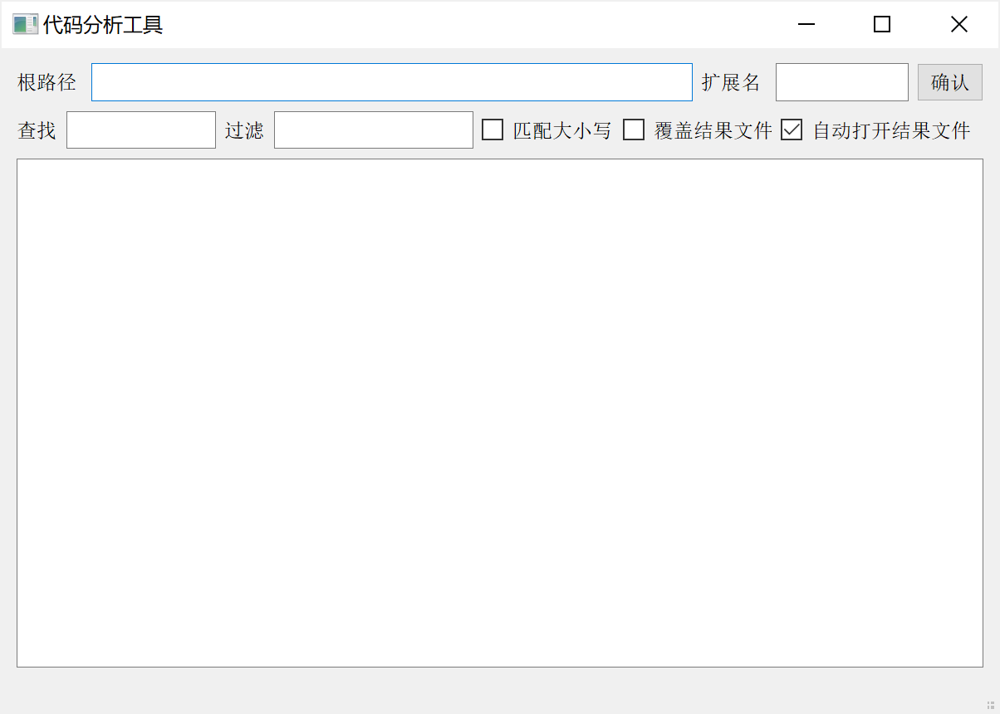
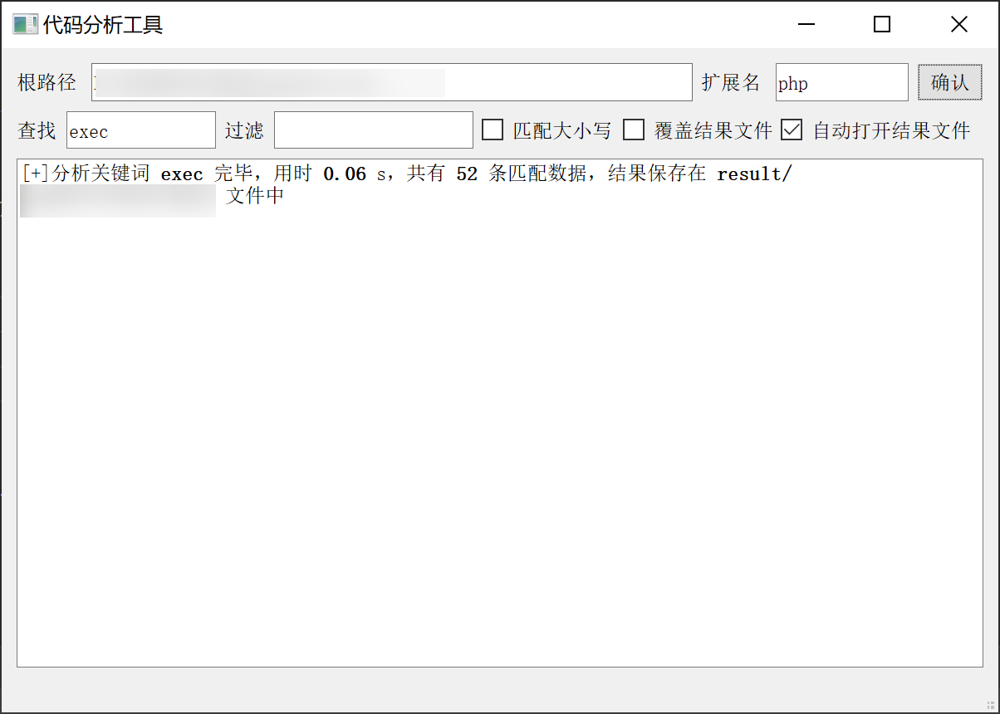
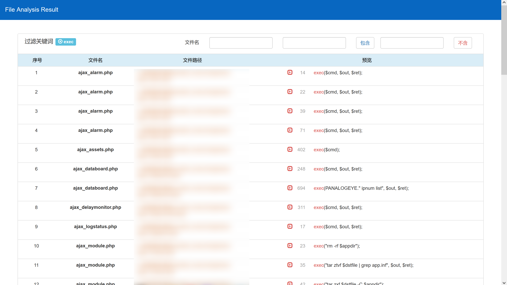
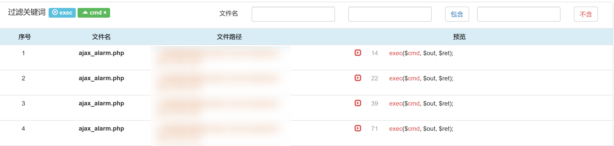
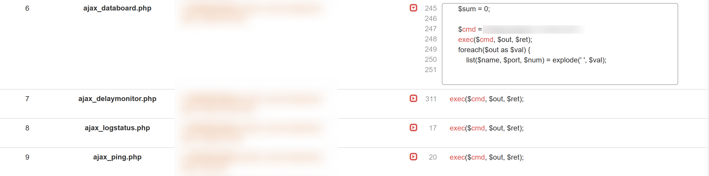

## 代码分析工具

本工具开发目的是使安全测试人员快速定位恶意代码及漏洞代码，节省查找与记录的时间。

#### 功能

* 快速查找与定位整个目录文件中的关键词
* 随时添加新的过滤词
* 分析结果以网页文件展示

#### 使用

* 采用PyQt5可视化接收用户输入

  	

  * 根路径：为源代码存储目录
  
  * 扩展名：可输入需要分析的文件扩展名，之间以逗号隔开
  
  * 查找：输入匹配关键词，不支持正则匹配
  
  * 过滤：输入后自动过滤内容或名称包含该关键词的文件，可输入多个，以逗号隔开
  
  * 匹配大小写：勾选后，查找关键词匹配大小写
  
  * 覆盖结果文件：勾选后，同一根目录的结果文件将采用同一名称
  
  * 自动打开结果文件：默认勾选，结果分析完毕后自动用浏览器打开结果文件
  
  * 示例：
  
    		
  
* 结果文件默认存储在工具根目录下的result文件夹下，根据分析代码生成文件名，前端采用`Vue.js`+`bootstrap`：

  	

  * 文件名和关键词动态匹配，点击“包含”、“不含”按钮或回车后自动添加该关键词至过滤标签，并在预览文本中高亮显示

    	

  * 鼠标移至预览列后自动展示匹配代码附近五行内容：

    	

    点击可固定预览区，鼠标移走后不收回：

    

